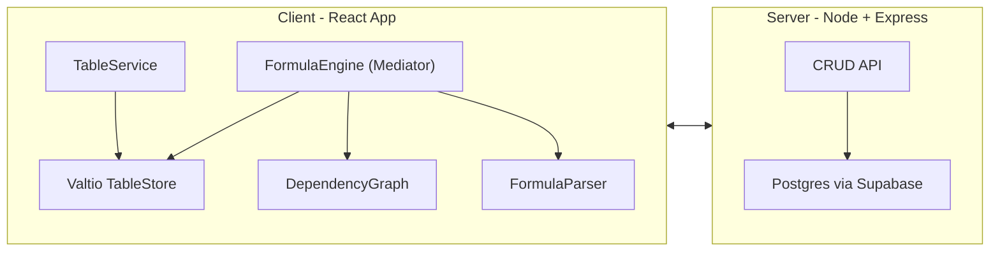
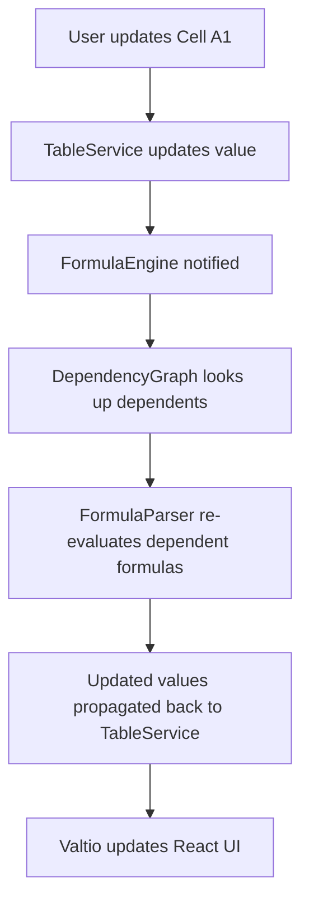
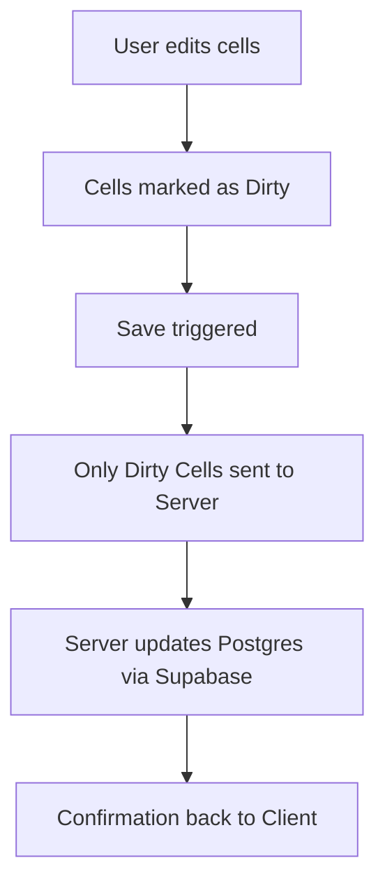

# 📊 Tabular

*A high-performance spreadsheet app built with React, Node, and Postgres (via Supabase).*

---

## 🚀 Demo


---

## 📝 Introduction

Traditional React apps **struggle with large spreadsheets**. Rendering 50,000+ cells overwhelms the DOM and causes lag, even with `memo` optimizations.

Formula evaluation is also complex: **changing one cell should update all dependent cells**, which requires efficient dependency tracking.

**Tabular solves these challenges** by combining:

* **Frontend virtualization** → Only visible cells render, making huge spreadsheets fast.
* **Dependency graph evaluation** → Ensures formulas update correctly when inputs change.
* **Database persistence** → Sheets are saved in Postgres (via Supabase) with efficient syncing.

This project demonstrates **system design thinking, performance optimization, and clean architecture** in a full-stack application.

---

## ✅ Features

### What it has

* **Large spreadsheets** (50k+ cells) rendering efficiently
* **Formula evaluation** (basic arithmetic, BODMAS)
* **Database persistence** (Postgres via Supabase)
* **CRUD operations** (create, update, delete spreadsheets)

### What it doesn’t (yet)

* Cell resizing
* Add/remove columns
* Cross-compatibility with other file types (CSV/Excel import/export)

---

## 💡 Problem It Solves

* **Large spreadsheets in React**

  * ❌ Rendering 50k cells directly → DOM bottleneck.
  * ✅ Solved with **frontend virtualization** → only visible rows/columns rendered.

* **Formula evaluation complexity**

  * ❌ Updating one cell breaks dependents without proper tracking.
  * ✅ Solved with a **dependency graph** that updates all descendant cells automatically.

---

## 🏟️ Architecture

### High-Level System



---

### Formula Evaluation Flow



---

### Persistence Flow (Dirty Cells Strategy)



---

## ⚙️ Technical Highlights

* **Frontend Virtualization** → Uses [React Virtualized](https://github.com/bvaughn/react-virtualized) to render only visible cells.
* **Formula Evaluation** → Arithmetic handled with a custom parser, respecting BODMAS.
* **Dependency Graph** → Tracks cell relationships; ensures dependent cells update automatically.
* **Formula Engine** → Mediator class orchestrating services, preventing cyclic dependencies.
* **Valtio State Management** → Centralized reactive state (`tableStore`) available in both JS services and React UI.
* **Efficient Persistence** → Only user-modified cells (`dirtyCells`) are sent to the server for DB updates.

---

## 🛠️ Tech Stack

* **Frontend** → React, React Virtualized, Valtio
* **Backend** → Node.js, Express
* **Database** → Postgres (via Supabase)

---

## 🔧 Setup & Installation

1. **Clone the repo**

   ```bash
   git clone https://github.com/rybhrdwj/tabular.git
   cd tabular
   ```

2. **Install dependencies**

   ```bash
   cd client && npm install
   cd ../server && npm install
   ```

3. **Set up Supabase/Postgres**

   * Create a Supabase project
   * Add connection URL & credentials in `.env`

4. **Run backend**

   ```bash
   cd server
   npm run dev
   ```

5. **Run frontend**

   ```bash
   cd client
   npm start
   ```

---

## 💻 Usage

* Create a new spreadsheet
* Enter values and formulas (e.g. `=A1+B2`)
* Save to database
* Load/update/delete spreadsheets

---

## 🔮 Future Scope

* ✅ **UI Enhancements** → Add/remove columns
* ✅ **Cross-compatibility** → Import/export CSV, Excel
* ✅ **Advanced formulas** → `SUM`, `AVERAGE`, etc.
* ✅ **Collaboration** → Multi-user editing with Supabase Realtime or WebSockets
* ✅ **Undo/Redo history**

---

## 📜 License

MIT License

---
